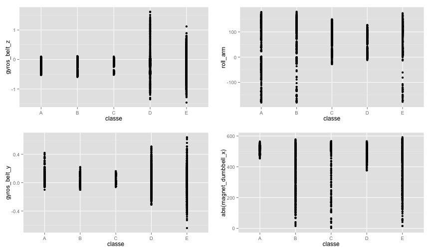
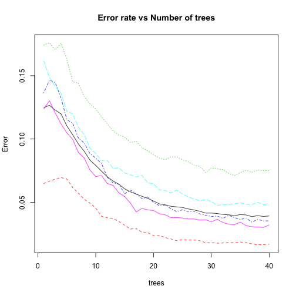

# &nbsp;&nbsp;&nbsp;&nbsp;&nbsp;&nbsp;&nbsp;&nbsp;&nbsp;&nbsp;&nbsp;&nbsp;&nbsp;Analysis of Weight Lifting Excersize

<br>
<br>
### Introduction

The dataset contains measurements from several detectors placed on the arm, forearm and belt of a person involved in a workout session. Several thousand recording have been made during correct and 4 incorrect ways of doing a certain excersize. Based on those instanteneous measurements it is then predicted if the person is doing and excersize properly or, if not, which one of the most common mistakes are being made.

### Covariates analysis

Below is a graph of the most distinctive variables.

 

On top left in can be seen that "gyros_belt_z" is a very useful variable to pick out classes D or E of the exercise, because for others this value is very close to zero. That's to be expected, as your hand is only supposed to move in two planes if the excercise is done correctly.

Bottom left, "gyros_belt_y", allows to pick out classes B and C with a relatively high probability if measured value is low.

Shown on the top right, "roll_arm" can allow to distinguish A and B classes from the rest. However, the abosulte values are a bit different for each of the participants, resulting in an almost even spread of the values if looked at all 6 people at the same, so to correctly make use of this variable, it should somehow be decided what group the measurement that is being predicted belongs to. 

A higly covariated "yaw_arm" variable is added to do that.

The last one shown, on the bottom right, "magnet_dumbbell_x", also has large differences between measurements, it's absolute value (since it is negative for some participants) can potentially help distinguish A, C and D classes, with even higher chance of it being A, although varying slightly across participants. "magnet_dumbbell_y" also shows the same trend and can therefore be added to increase accuracy.


This would results to a model with 6 covariates, but a couple more are added for an increased accuracy:

```r
modfit <- randomForest(classe ~ gyros_belt_z + gyros_belt_y + roll_arm + yaw_arm + 
    magnet_dumbbell_x + magnet_dumbbell_y + accel_arm_y + pitch_forearm + yaw_forearm + 
    roll_dumbbell, ntree = 40, data = training)
```

Which gives a consedarably low Out-of-Bag error rate of only 3.92%. The confusion matrix is shown below:

```
##      A    B    C    D    E class.error
## A 5486   42   17   30    5     0.01685
## B  110 3512  108   41   26     0.07506
## C   12   67 3301   28   14     0.03536
## D    6   11  110 3062   27     0.04789
## E    7   39   36   34 3491     0.03216
```

From which it can be seen that there is a very low chance of false negative - that is, classifying your execution of an exercise as incorrect when in fact everything was ok. It would be reasonable to assume that it is very important to have this error as the lowest, thus not allowing a person to mistakenly learn an improper way of doing an excersize.  

 

Using more than 40 trees barely decreases error rates (drops to about 5% with 500 trees), and that will most likely introduce a lot of overfitting, which is undesirable.

When trained on a subset of a training data set (the one correct answers are known to), the following are the results:

```r
ind <- sample(seq(1, 19622), 9811)  # random indices to spit
trains <- training[ind, ]
tests <- training[-ind, ]
trains <- trains[sample(nrow(trains)), ]  # shuffle rows
tests <- tests[sample(nrow(tests)), ]  # shuffle rows
subfit <- randomForest(classe ~ gyros_belt_z + gyros_belt_y + roll_arm + yaw_arm + 
    magnet_dumbbell_x + magnet_dumbbell_y + accel_arm_y + pitch_forearm + yaw_forearm + 
    roll_dumbbell, ntree = 40, data = trains)
pred <- predict(subfit)
confusionMatrix(pred, trains$classe)
```

```
## Confusion Matrix and Statistics
## 
##           Reference
## Prediction    A    B    C    D    E
##          A 2693   94   11   18   11
##          B   39 1623   49   15   37
##          C   20   82 1628   79   37
##          D   18   37   29 1470   21
##          E   11   28   16   21 1724
## 
## Overall Statistics
##                                         
##                Accuracy : 0.931         
##                  95% CI : (0.926, 0.936)
##     No Information Rate : 0.283         
##     P-Value [Acc > NIR] : < 2e-16       
##                                         
##                   Kappa : 0.913         
##  Mcnemar's Test P-Value : 3.49e-12      
## 
## Statistics by Class:
## 
##                      Class: A Class: B Class: C Class: D Class: E
## Sensitivity             0.968    0.871    0.939    0.917    0.942
## Specificity             0.981    0.982    0.973    0.987    0.990
## Pos Pred Value          0.953    0.921    0.882    0.933    0.958
## Neg Pred Value          0.987    0.970    0.987    0.984    0.987
## Prevalence              0.283    0.190    0.177    0.163    0.187
## Detection Rate          0.274    0.165    0.166    0.150    0.176
## Detection Prevalence    0.288    0.180    0.188    0.161    0.183
## Balanced Accuracy       0.975    0.927    0.956    0.952    0.966
```

### Conclusions

Overall, the model gives small errors: about 7% overall - much higher than previous OOB estimates, as expected - and very low probability of incorrectly identifying an exercize as being carried out improperly in any way - 2.5%. The actual out-of-sample error rate may be slightly higher, but 6-7% is probably very close to what one would get. Choice of variables to use was made both by using all the data and subset data for each of the six participants, so it might be a bit biased. For the 20 available testing measurements, accuracy was 100%, but that's not a large enough sample to properly estimate out-of-sample error.

The above model can be improved for actual use and "adapt" during the execrsize to the person, because accuracy can be greatly increased by processing not only several measurements, but also its variances, as it can say a lot, when mean/median values for some of variables are known. And simply having several measurements to produce out a single outcome vastly reduces the chance of error to being, essentially, negligible.
